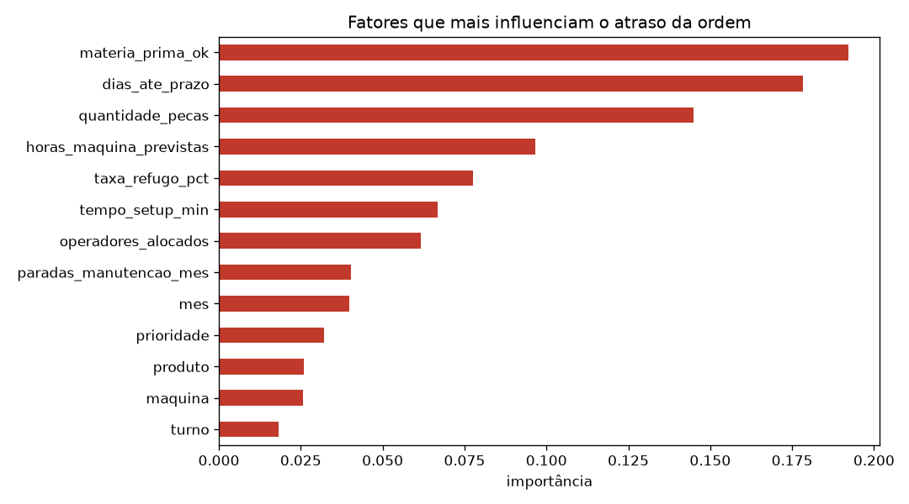

# Previsão de Atraso em Ordens de Produção

Projeto de **Machine Learning** aplicado ao dia a dia do **PCP** (Planejamento e Controle da Produção):
a partir do histórico de ordens de produção, um modelo lê as informações de uma ordem nova
e estima se ela tende a sair **Adiantada**, **No_Prazo** ou **Atrasada** — antes do problema acontecer,
quando ainda dá tempo de repriorizar a fila, negociar prazo ou garantir material.

## A base de dados

Histórico sintético de 6.000 ordens de uma indústria metalúrgica, gerado pelo `gerar_dados.py`
com lógica realista de chão de fábrica:

| Coluna | Descrição |
|---|---|
| `id_ordem` | identificador da ordem (OP-00001...) |
| `mes` | mês de liberação da ordem |
| `produto` | tipo de peça (Engrenagem, Eixo, Flange, Suporte, Carcaça) |
| `maquina` | recurso produtivo (CNC-01, Torno-03, Fresadora-01...) |
| `turno` | turno de produção (Manhã, Tarde, Noite) |
| `quantidade_pecas` | tamanho do lote |
| `tempo_setup_min` | preparação da máquina em minutos |
| `horas_maquina_previstas` | horas de máquina estimadas para o lote |
| `prioridade` | Baixa / Média / Alta / Urgente |
| `materia_prima_ok` | se o material está disponível (Sim/Não) |
| `operadores_alocados` | quantos operadores na célula |
| `taxa_refugo_pct` | % de peças refugadas |
| `paradas_manutencao_mes` | paradas não planejadas no mês |
| `dias_ate_prazo` | dias disponíveis até o prazo combinado |
| `status_prazo` | **o que o modelo prevê**: Adiantado / No_Prazo / Atrasado |

## Como funciona

1. `gerar_dados.py` cria o histórico (`ordens_producao.csv`) e ordens novas sem status (`novas_ordens.csv`)
2. O notebook converte colunas de texto em números com `LabelEncoder`
3. Separa 75% dos dados para treino e 25% para teste (`train_test_split`)
4. Compara dois classificadores: **Random Forest** vs **KNN** (com escalonamento)
5. O melhor modelo prevê o status das 10 ordens novas que entraram hoje no PCP

## Resultados

| Modelo | Acurácia no teste |
|---|---|
| **Random Forest (400 árvores)** | **80.5%** |
| KNN (k=7, dados escalados) | 74.3% |

Fatores que mais pesam para uma ordem atrasar, segundo a importância das variáveis do Random Forest:



Prazo curto, falta de matéria-prima e lote grande lideram — exatamente as alavancas que a produção
usa para reagir antes do atraso virar bola de neve.

## Como rodar

```bash
python -m venv .venv
source .venv/bin/activate      # Windows: .venv\Scripts\activate
pip install -r requirements.txt

python gerar_dados.py          # gera os CSVs (opcional, já estão no repositório)
jupyter notebook analise_atrasos.ipynb
```

## Estrutura

```
├── gerar_dados.py            # gerador da base sintética
├── analise_atrasos.ipynb     # análise completa + treinamento + previsões
├── ordens_producao.csv       # histórico (6.000 ordens)
├── novas_ordens.csv          # ordens novas a prever
└── assets/                   # gráficos gerados pelo notebook
```


Apenas para estudos
